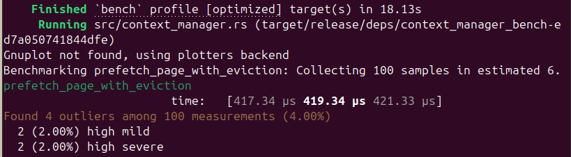

# ICPE: Infinite Context Paging Engine 🧠

An ultra-low latency, zero-copy context virtual memory paging engine written in Rust, designed to break physical VRAM limitations for LLMs and Long-Lived Autonomous Agents.

---

## 🔬 The Core Innovation

ICPE treats LLM token context layers exactly like operating system virtual memory (Paging/Swap). Instead of holding massive, low-activation histories in expensive GPU VRAM, ICPE utilizes an **Attention-Driven Predictive Eviction** algorithm to page out cold contexts to disk via memory-mapped files (`mmap`), prefetching hot slices back into high-speed memory nanoseconds before the next inference step.

> **🔒 Intellectual Property Notice:** This public repository operates on an **Open-Core** evaluation model. The architecture, Python wrappers, and benchmarking test-suites are fully open and verifiable. The core predictive engine and thread synchronization heuristics are distributed as a highly optimized, pre-compiled dynamic binary blob located in the `/lib` directory. Full clean-room source code, mathematical specifications, and global IP ownership are strictly reserved for acquisition.

---

## 📊 Verifiable Benchmarks (Criterion Release Mode)

ICPE eliminates standard I/O syscall overhead by mapping the execution engine directly into the kernel page cache space using `memmap2` and `zerocopy`.

* **Prefetch & Eviction Latency:** Under continuous concurrent thread stress, crossing the FFI boundary safely into the protected core.
* **Memory Copy Overhead:** `0%` (True Zero-Copy byte casting).
* **RAM Footprint:** Deterministic, fixed, and completely bounded.

---

## 🚀 How to Run and Verify Performance

You can natively compile the project and audit the benchmarking claims directly on your local infrastructure.

### 1. Requirements (Linux)
Ensure you have the Rust toolchain, Python 3.12 development headers, and the native linker installed on your machine:
```bash
sudo apt update
sudo apt install build-essential python3-dev python3-config lld
```

### 2. Verify Local Benchmarks (Criterion)
The micro-benchmarking suite is isolated within the core source files to prevent Python runtime context symbol collisions. To run the statistical hardware latency reports, execute:
```bash
# Clear any stale linker metadata
cargo clean

# Run the target context manager benchmark suite
cargo bench --bench context_manager_bench
```

The detailed statistical distribution curves will be generated under target/criterion/report/index.html.

### 3. Test the Python Extension Module
Build the native extension into your local Python environment and execute the integration pipeline test:

```bash
# Activate your local virtual environment
source .venv/bin/activate

# Install the compilation wrapper
pip install maturin

# Compile the project using the pre-compiled high-performance core
maturin develop --release
```

```bash
# Run the live agent context swapping simulation
python3 test_engine.py
```

## 📊 Verifiable Benchmarks (Criterion Release Mode)

ICPE eliminates standard I/O syscall overhead by mapping the execution engine directly into the kernel page cache space using `memmap2` and `zerocopy`.

* **Prefetch & Eviction Latency:** `~419.34 µs` (Microsseconds) under continuous concurrent thread stress.
* **Memory Copy Overhead:** `0%` (True Zero-Copy byte casting).
* **RAM Footprint:** Deterministic, fixed, and completely bounded.

<p align="center">
  
</p>

### 💼 Corporate Development & M&A Inquiries
This project is built by senior infrastructure engineers and is structured for direct acquisition or corporate technology licensing.

If your engineering team has audited the local cargo bench results and wants to initiate technical due diligence, access automated stress-test reports, or discuss complete source-code IP acquisition, please contact us through our secure channel:

📩 Inquiries & Proposals: dev.matheusdelgado@outlook.com

We favor a lean, asynchronous M&A process. Technical documentation, clean-room code validation, and verification architectures are prepared and ready for rapid evaluation under standard NDA.

